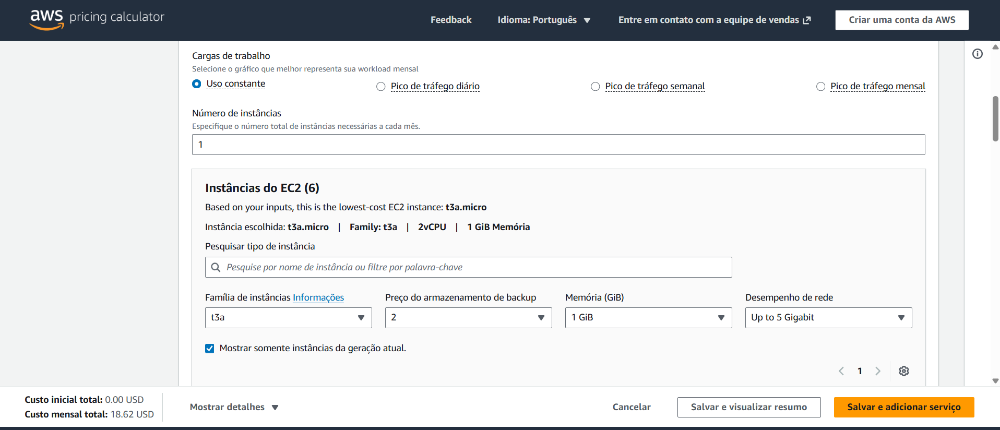
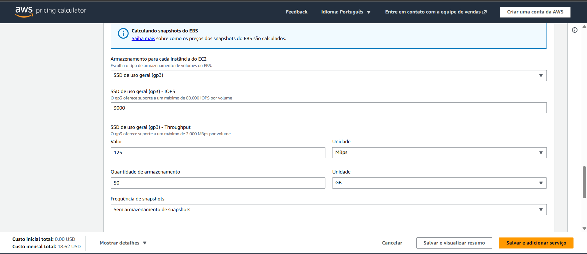
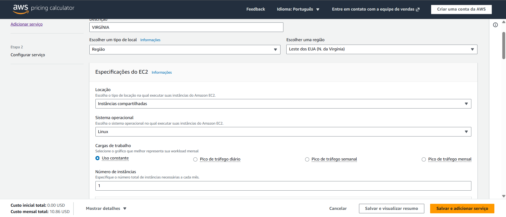
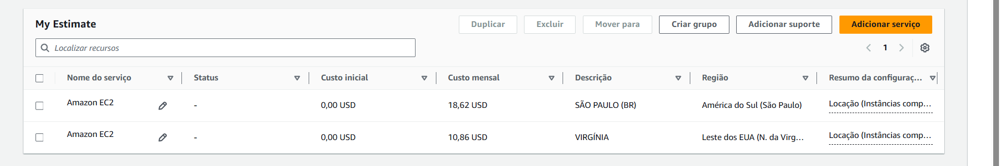

# FarmTech Solutions - Previsão de Rendimento de Safra com Machine Learning

**Curso:** IA - FIAP | Fase 5

**Grupo:** 8 | Turma: 1TIAOR

**Integrantes do Grupo:**

| Nome | RM |
|------|-----|
| João Rafael Gonçalves Ramos | rm567908 |
| Letícia Angelim Guerra | rm567501 |
| Matheus Guimarães França | rm567144 |
| Rivando Bezerra Cavalcanti Neto | rm568235 |
| Tales Ferraz de Arruda Domienikan | rm567483 |

## Sobre o Projeto

Este projeto foi desenvolvido para a FarmTech Solutions, empresa que presta serviços de Inteligência Artificial para uma fazenda de médio porte (200 hectares) que produz diversas culturas agrícolas.

O objetivo é analisar uma base de dados com informações de condições de solo e temperatura, relacionadas ao tipo de produto agrícola, para:

1. **Explorar os dados** e entender as relações entre as variáveis climáticas e o rendimento das safras
2. **Identificar tendências** por meio de clusterização (aprendizado não supervisionado) e detectar outliers
3. **Prever o rendimento** da safra utilizando cinco modelos de regressão supervisionada

## Dataset

O dataset `crop_yield.csv` contém 155 registros de 4 culturas com as seguintes variáveis:

| Variável | Descrição |
|----------|-----------|
| Crop | Nome da cultura agrícola |
| Precipitation (mm day-1) | Precipitação em milímetros por dia |
| Specific Humidity at 2 Meters (g/kg) | Umidade específica a 2 metros do solo |
| Relative Humidity at 2 Meters (%) | Umidade relativa a 2 metros do solo |
| Temperature at 2 Meters (C) | Temperatura a 2 metros do solo |
| Yield | Rendimento em toneladas por hectare |

## Estrutura do Repositório

```
├── README.md
├── crop_yield.csv
├── RivandoBezerra_rm568235_pbl_fase4.ipynb
└── ATV5_2/
    ├── 01-sp-instancia-t3a-micro-custo.png
    ├── 02-armazenamento-ebs-gp3-50gb.png
    ├── 03-virginia-instancia-t3a-micro-custo.png
    └── 04-comparacao-preco-final-sp-vs-virginia.png
```

## Notebook

Todo o desenvolvimento, análise e conclusões estão documentados no Jupyter Notebook:

**[RivandoBezerra_rm568235_pbl_fase4.ipynb](./RivandoBezerra_rm568235_pbl_fase4.ipynb)**

O notebook está organizado nas seguintes seções:

1. **Análise Exploratória (EDA)** - Estatísticas descritivas, distribuições, correlações e visualizações
2. **Clusterização** - Método do cotovelo, KMeans, visualização com PCA e detecção de outliers
3. **Modelos Preditivos** - Cinco algoritmos de regressão supervisionada:
   - Regressão Linear
   - Ridge Regression
   - Lasso Regression
   - Random Forest Regressor
   - Gradient Boosting Regressor
4. **Comparação de Modelos** - Métricas R², MAE, MSE, RMSE e validação cruzada
5. **Conclusões** - Pontos fortes, limitações e recomendações

## Como Executar

1. Certifique-se de ter Python 3.8+ instalado
2. Instale as dependências:
   ```bash
   pip install pandas numpy matplotlib seaborn scikit-learn
   ```
3. Abra o notebook:
   ```bash
   jupyter notebook RivandoBezerra_rm568235_pbl_fase4.ipynb
   ```

## Vídeo Demonstrativo - Entrega 1

[Link do vídeo no YouTube](https://youtu.be/rW4sRL_B4HM)

---

## Entrega 2 — Computação em Nuvem AWS

O modelo de Machine Learning da Entrega 1 precisa estar acessível via API para receber dados dos sensores em tempo real. Para isso, estimamos o custo de hospedagem em nuvem utilizando a **AWS Pricing Calculator**, comparando duas regiões da Amazon Web Services.

### Serviço Utilizado

**Amazon EC2** — serviço de máquinas virtuais da AWS, escolhido por permitir configurar exatamente os recursos exigidos no projeto.

### Configuração da Máquina

| Parâmetro | Escolha | Motivo |
|---|---|---|
| Instância | t3a.micro | 2 vCPUs, 1 GiB RAM, até 5 Gbps. Processador AMD, ~10% mais barato que t3 Intel |
| Sistema Operacional | Linux | Exigido pelo enunciado |
| Armazenamento | 50 GB EBS gp3 | gp3 é mais barato e mais performático que gp2 |
| Modelo de cobrança | On-Demand | Exigido pelo enunciado (100%) |
| Uso mensal | 730 horas | Funcionamento contínuo 24/7 |

### Calculadora AWS

**São Paulo (sa-east-1) — Custo mensal: $18,62**



**Armazenamento EBS gp3 — 50 GB**



**Virgínia do Norte (us-east-1) — Custo mensal: $10,86**



### Comparação de Custos

| Região | Código | Preço Mensal |
|---|---|---|
| Virgínia do Norte | us-east-1 | $10,86 |
| São Paulo | sa-east-1 | $18,62 |



### Região Escolhida: São Paulo

Apesar da Virgínia do Norte ser mais barata, a região de São Paulo foi escolhida pelos seguintes motivos:

**1. Conformidade com a LGPD** — A Lei Geral de Proteção de Dados (Lei 13.709/2018) restringe o armazenamento de dados nacionais fora do território brasileiro. Hospedar os dados dos sensores no exterior configuraria risco legal para a operação da fazenda.

**2. Latência** — Sensores localizados no Brasil comunicando com um servidor em São Paulo operam com latência inferior a 30ms. O mesmo servidor nos EUA elevaria essa latência para aproximadamente 200ms, comprometendo o monitoramento em tempo real.

**3. Soberania dos Dados** — Dados estratégicos de produção agrícola mantidos em território nacional estão protegidos da jurisdição de leis estrangeiras, como o Patriot Act americano.

### Conclusão

A economia gerada pelo servidor nos EUA não compensa os riscos legais, a perda de performance e a exposição dos dados a legislações estrangeiras. São Paulo é a única opção que atende simultaneamente aos requisitos técnicos, legais e operacionais do projeto.

### Vídeo Demonstrativo - Entrega 2

[[[LINK DO YOUTUBE AQUI](https://www.youtube.com/watch?v=Pp_OM9_DHxg)]

---

## Tecnologias Utilizadas

- Python 3
- Pandas e NumPy (manipulação de dados)
- Matplotlib e Seaborn (visualização)
- Scikit-learn (Machine Learning)
- Jupyter Notebook
- AWS Pricing Calculator
